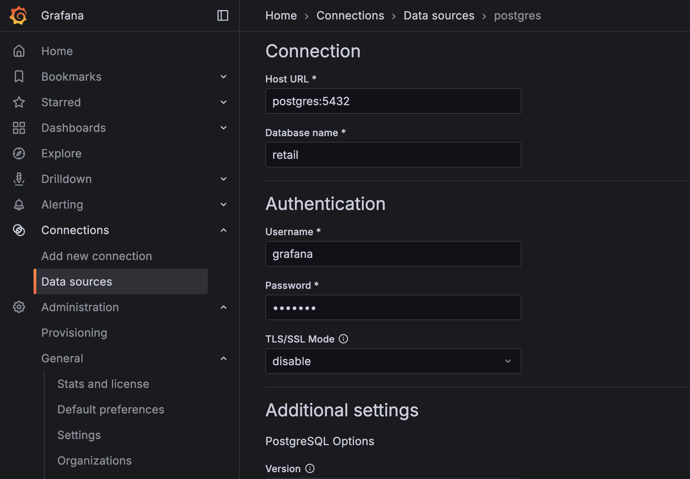
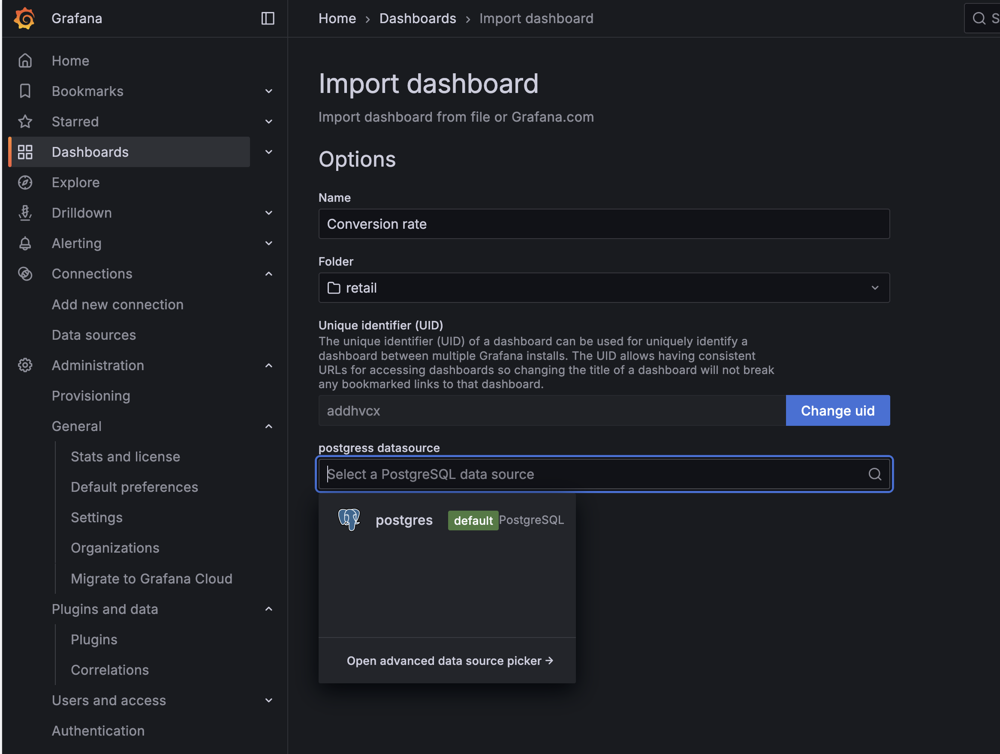
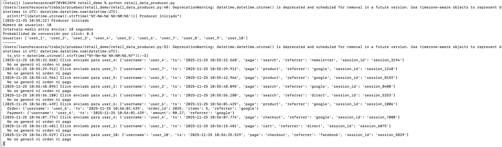
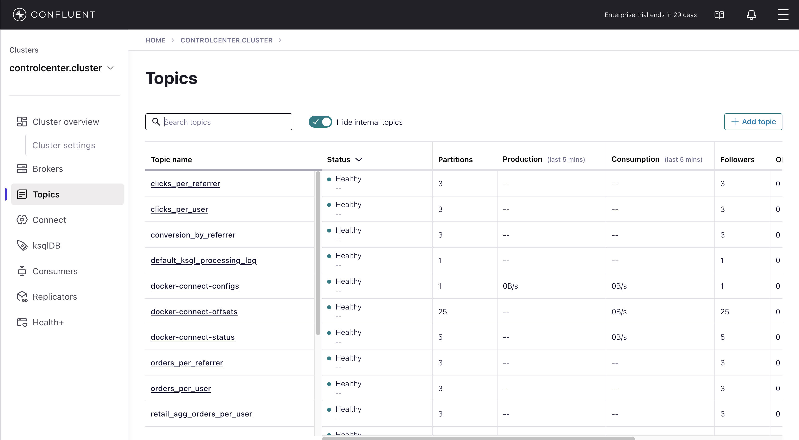
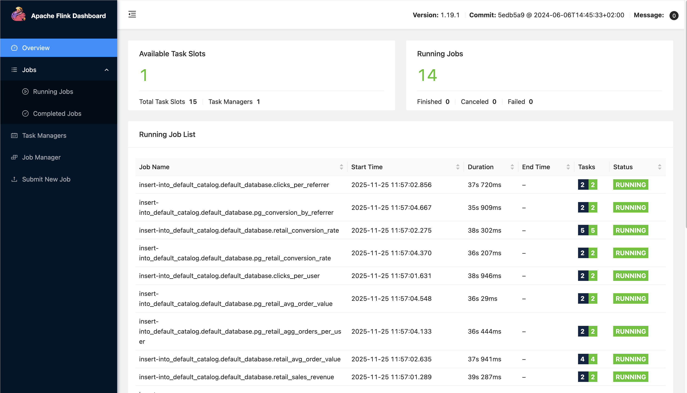
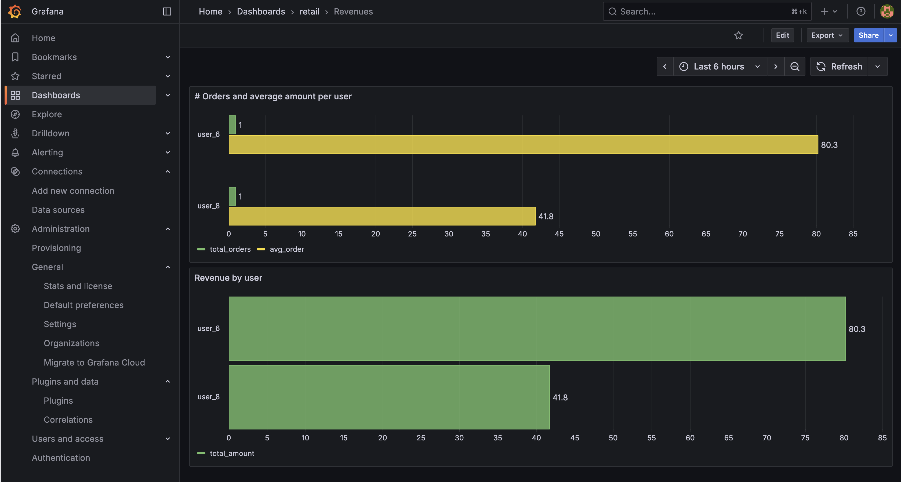

# Retail demo 
This repository contains the necessary artifacts to create and execute a demo with Confluent Platform. This demo can be executed on a local computer with no connection to internet (you do need connection to download the docker images in the first iteration)
The demonstration contains the following components:
- A complete Confluent Platform built using Docker.
- A grafana container to be able to show dashboards.
- A postgres database container to store data products.
- A producer written in Python in order to write data into the data stream.

## Requisites
This demo has been tested using the following software:
- MacOS 15.7.2
- Docker desktop 4.49. 
- Python 3.14
- Pip to install libraries in python
It should work with similar resources under other operating systems, but it was not tested in Windows or Linux.
**NOTE**: Memory requirements are quite high as this demo setups a bunch of different containers. 16 Gb of RAM is recommended. However, the docker-compose.yml file can be modified to save resources.

## Setup

 - Clone this repository to a local folder in order to have all the resources available.

 `git clone https://github.com/lsacera/retail_demo`
 - Go to the cloned folder and create all the docker containers using the docker command:

 `docker compose up -d`
 - Once the machines are created, wait a couple of minutes to let all the services start. You can check the status by executing the command `docker ps`. 
 Also, the status of control center can be checked in the url `http://localhost:9021`.
 Some needed resources must be copied in the the contaniers. Execute the following commands:

 `chmod +x copy_resources.sh`

 `./copy_resources.sh`

 These commands will copy the needed jars and sql file into the Flink-related containers. When the copy is finished, do not forget to restart such contaniers using the following command:

 `docker compose restart flink-sql-client flink-jobmanager flink-taskmanager`
 (This command will reload the needed libraries in the containers.)
 - Then, create the needed kafka topics in the kafka cluster. To do so, there is an automated script that can be used. Execute:

`chmod +x create_topics.sh`

 `./create_topics.sh`
 - Then create the needed tables into postgres. There is an automated script to ease this procedure. Execute:

`chmod +x init_db.sh`

 `./init_db.sh`
 - Create a data source in grafana. To do so, open grafana in the Web Browser in the address http://localhost:3000 (the first time, a new admin password should be set. The default password is "admin").
In the left menu, go to "Connections --> Data sources" option.
In the screen, select the top-right button "Add new datasource".
In the search box, search for "postgres" and select the Postgres data source.
The creation dialog will appear. The importan fields are the following:
	 - Name: select a name for the connector
	 - Connection: select "postgres:5432" as the host url and "retail" for the database name.
	 - Authentication: select "grafana" and "grafana" as the user and password for the database. This is defined in the dockerfile.
	 - TLS/SSL Mode: disable. This setting is very important as the database is not secured in this demo.
	 
	 

	Leave the rest as default. Scroll down and click on the "Save and test" button to see that the connection is working.
	
 - Once the datasource is set up, import the dashboards into grafana. Follow these steps:
	 - Open grafana url at http://localhost:3000 and enter with admin credentials.
	 - Go to "Dashboards" on the left menu.
	 - Create a new folder by clicking on the button "New" at the top right and selecting "New folder".  Give the folder a name and click "Create".
	 - Click on the "New" button at the top right of the page and select "Import"
	 - In the dialog that appears, click on "Upload dashboard JSON file" and look for the file "Grafana_Conversion rate.json" under the folder "grafana".
	 - Leave the unique identifier as is (can be changed if required)
	 - in the "postgres datasource" dropdown, select the datasource.
	 - Click on "Import" button.

 - Go back to the folder created before and do again the same steps to import a second file called "Grafana_Revenues.json"

The dashboards will not work now; this is normal.

## Demo execution
**Producer**
Once all resources are in place, new data can be created from the producer. To do so, it is better to create a python virtual environment to import the necesary libraries and execute the producer.
Open a terminal and execute the following commands:

`python3 -m venv retail`

`source retail/bin/activate`

`pip install confluent-kafka`

Then start the producer with this command:
`python retail_data_producer.py`

This command will start producing data into the kafka cluster. By default, these values are used:
- num-users: 10 --> number of users generating data for
- interval: 10 --> seconds between message generation.
- conversion-prob: 0.3 --> probability that a click generates a purchase (order and payment)

The default parameters can be changed when invoking the producer, for example:
`python3 producer.py --num-users 50 --interval 5.0 --conversion-prob 0.5 --bootstrap-servers "kafka-broker-prod:9092"``

**Flink queries**
Once the producer is producing data into the kafka cluster, the data will be processed in real time using Flink. In order to make things easier, the flink queries can be sent to the flink container in a batch file by executing the following command (a new terminal should be opened for this)

`docker exec -it flink-sql-client /opt/flink/bin/sql-client.sh -f /opt/flink-retail.sql`

**Seeing results**
The demo can be checked out in the following resources:

 - **Confluent control center**: the main management console Web UI. Just go to http://localhost:9021 and the main cluster should appear there. Click on the cluster and then in the "Topics" link in the left side menu to see all the topics. The basic topics are "retail_clicks", "retail_orders" and "retail_payments". The rest of the topics are created and populated from the flink queries.

 - **Flink Web dashboard**: using a web browser, go to http://localhost:9081. In the Flink dashboard, all the running jobs (that is, the processing of the data from the topics) can see in the home page. (14 running jobs should be shown in this dashboard).

 - **Grafana**: the dashboards that were imported before should be populating with data. Remember grafana can be accesed in the url http://localhost:3000. Then go to the option "Dashboards" in the lef side menu and then select the folder and dashboard imported before. The dashboards reflect the real time data processed by Flink and materialized in the postgres database. Refresh the dashboards to start seeing results.

## Cleaning up resources
To clean the resources in the demo, all the containers in docker can be destroyed. 
Should you want to clean the resources to start with fresh data, be sure the python producer is not running and execute the following commands:

`chmod +x drop_db.sh`

 `./drop_db.sh`

 `chmod +x delete_topics.sh`

 `./delete_topics.sh`
